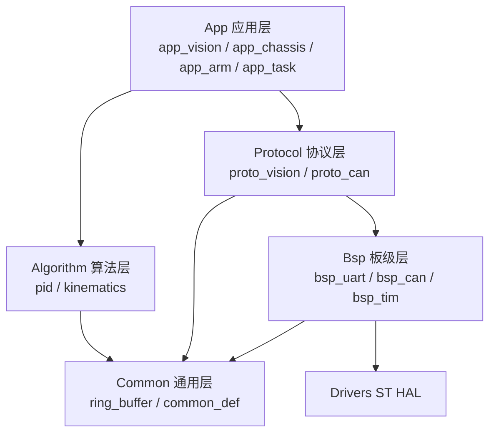
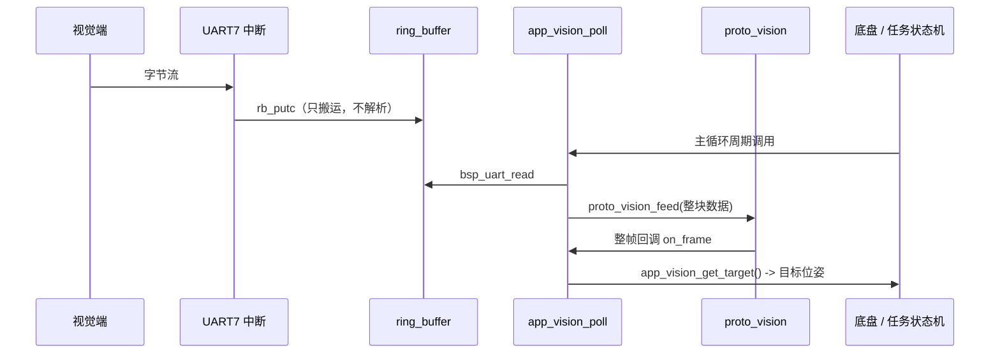

# 项目结构说明

STM32H723VGT6 机器人主控（底盘 / 机械臂 / 任务状态机）代码组织约定。

## 一、目录职责

```
STM32H723VGT6test/
├── Core/               ← CubeMX 生成（main.c / it.c / hal_msp.c / main.h）
│   ├── Inc/
│   └── Src/              只允许往 USER CODE BEGIN/END 区里写代码！
├── Drivers/            ← ST 官方 HAL + CMSIS，禁止修改
├── cmake/              ← CubeMX 生成的构建脚本，禁止修改
├── App/                ← 应用层：业务逻辑（会频繁改动）
│   ├── Inc/
│   └── Src/
│       └── app_vision.c    视觉数据处理（后续加 app_chassis / app_arm / app_task）
├── Bsp/                ← 板级支持层：HAL 外设封装
│   ├── Inc/
│   └── Src/
│       └── bsp_uart.c      串口收发（后续加 bsp_can / bsp_gpio / bsp_tim）
├── Protocol/           ← 通信协议层：帧的打包/解包
│   ├── Inc/
│   └── Src/
│       └── proto_vision.c  视觉链路帧协议
├── Common/             ← 通用工具（与硬件无关，可单元测试）
│   ├── Inc/
│   └── Src/
│       ├── common_def.h    类型/宏/返回码
│       └── ring_buffer.c   环形缓冲区
├── Algorithm/          ← 算法层（用到时再建，结构与上面一致）
│                            PID / 运动学 / 滤波 等纯计算代码
├── Doc/                ← 文档：协议定义、接线表、调试记录
└── Tools/              ← 上位机脚本、协议解析小工具（非 MCU 代码）
```

**为什么把用户代码放在 Core 外面？**
`Core/` 是 CubeMX 的"自留地"，重新 Generate Code 时会被覆盖（`main.c` 里只有 `USER CODE` 区是安全的）。
把业务代码全部放到 `App/ Bsp/ Protocol/ Common/`，CubeMX 怎么重新生成都不会影响你。

## 二、分层调用规则（只允许自上而下，禁止反向依赖）



| 规则 | 说明 |
| --- | --- |
| App 不直接调 HAL | 想发数据就调 `bsp_uart_send()`，想读数据就调 `app_vision_get_target()` |
| Protocol 不碰硬件 | 只做字节 ↔ 结构体的转换，方便单独测试 |
| Bsp 不认识业务 | `bsp_uart.c` 里不应该出现 "底盘"、"视觉坐标" 这类字眼 |
| Common 不依赖任何模块 | 谁都可以 include，它不 include 别人 |
| 跨模块只 include 头文件 | 不要在头文件里 include 别人的 .c 或定义变量 |

## 三、新增文件的固定动作

1. 按上表把 `.c` 放到 `<模块>/Src/`，`.h` 放到 `<模块>/Inc/`；
2. **不用改 CMakeLists.txt** —— 根 `CMakeLists.txt` 已经用 `GLOB_RECURSE ... CONFIGURE_DEPENDS`
   自动收集这五个目录下的所有 `.c`，并自动添加 `Inc` 头文件路径；
3. 如果新增了模块目录（比如 `Algorithm/`），在根 `CMakeLists.txt` 的
   `foreach(user_module App Bsp Common Protocol Algorithm)` 里补上目录名即可。

## 四、CubeMX 相关注意事项

- ⚠️ **UART7 中断必须使能**：`bsp_uart` 用的是中断接收，需要在 CubeMX 的
  `Connectivity → UART7 → NVIC Settings` 勾选 `UART7 global interrupt`，
  否则 `HAL_UART_Receive_IT()` 会"启动成功但永远收不到数据"。
- ⚠️ **保存前先 Revert**：在 VS Code 里若 `main.c` 有未保存改动，直接保存会覆盖
  CubeMX 新生成的代码（丢失 `huart7`、`MX_xxx_Init`）。Generate Code 后先选 "Revert File"。
- 引脚固定为 `PE8 = UART7_TX`、`PE7 = UART7_RX`，115200-8-N-1。

## 五、视觉链路数据流



设计要点：

- **中断只搬字节**，解析放在主循环，避免在 ISR 里做耗时操作；
- 环形缓冲 512 字节，主循环再慢也不会丢数据（支持约 40ms 的阻塞）；
- 视觉掉线 **200ms 自动置 `valid = false`**，防止用旧数据继续控制底盘；
- 统计里能看到 `crc_errors / ok_frames / lost_frames / ovf`，联调时直接看这几个数就能定位问题。

## 六、帧协议（待与视觉端确认后同步 `Protocol/Inc/proto_vision.h`）

```
+------+------+-----+-----+-----+---------------+------+
| 0xAA | 0x55 | LEN | SEQ | CMD |    PAYLOAD    | CRC8 |
+------+------+-----+-----+-----+---------------+------+
```

- `LEN`：PAYLOAD 字节数（0~64）
- `SEQ`：帧序号，用于丢帧统计
- `CMD`：`0x01` 目标位姿 / `0x02` 状态心跳
- `CRC8`：CRC-8/MAXIM（poly `0x8C` 反射，init `0x00`），覆盖 `LEN..PAYLOAD`

`CMD = 0x01` 的 payload（小端）：

| 偏移 | 类型 | 含义 |
| --- | --- | --- |
| 0 | int16 | `x_mm` 目标相对 X（mm） |
| 2 | int16 | `y_mm` 目标相对 Y（mm） |
| 4 | int16 | `yaw_cdeg` 目标偏航角（0.01°） |
| 6 | uint8 | `detect` 检测有效标志 |

> 若视觉端用的是别的格式（比如定长帧、文本行、RoboMaster 裁判系统格式），
> 只需改 `proto_vision.c` 的状态机和这两个头文件里的常量，App 层不用动 —— 这就是分层的意义。

## 七、Git 管理建议

### 分支

| 分支 | 用途 |
| --- | --- |
| `main` | 随时可上车跑的稳定版本，只接受合并 |
| `dev` | 日常集成，功能做完先合到这里跑通 |
| `feat/xxx` | 单个功能，如 `feat/chassis-pid`、`feat/vision-uart` |
| `fix/xxx` | 单点修复 |

### 提交信息（Conventional Commits，中文描述）

```
feat(vision): 增加视觉目标帧解析与超时保护
fix(bsp): 修复串口溢出后接收停止的问题
refactor(chassis): 拆分底盘速度解算与 PID
docs(protocol): 补充视觉链路帧协议说明
build(cmake): 用户模块源文件改为自动收集
```

### 当前 `.gitignore` 已覆盖

`build/`、`*.elf / *.hex / *.bin / *.o / *.map`、`.vscode/settings.json`、`mx.scratch/` 等，
不需要再改。建议第一次提交把当前 CubeMX 生成的基线（含 `.ioc`）先提交一次，之后每改一个外设就打一个 tag。

### 建议的提交节奏

1. `git add .ioc Core cmake` + 提交 `chore(cubemx): UART7 配置` —— 配置类改动单独一笔，便于回滚；
2. `git add App Bsp Protocol Common CMakeLists.txt` + 提交 `feat(vision): 新增串口通信分层框架`；
3. 之后每完成一个小功能提交一次，别攒一大坨。

## 八、下一步建议

- [ ] CubeMX 里勾选 `UART7 global interrupt` 并重新生成代码（否则收不到数据）
- [ ] 与视觉端确认帧格式，同步 `proto_vision.h`
- [ ] 在 `App/Src/` 下按同样结构补 `app_chassis.c` / `app_arm.c` / `app_task.c`
- [ ] 任务状态机建议用"表驱动"（状态 → 事件 → 动作），避免 `switch` 嵌套过深
- [ ] 底盘/机械臂的 PID 与运动学放 `Algorithm/`，保持可单元测试
